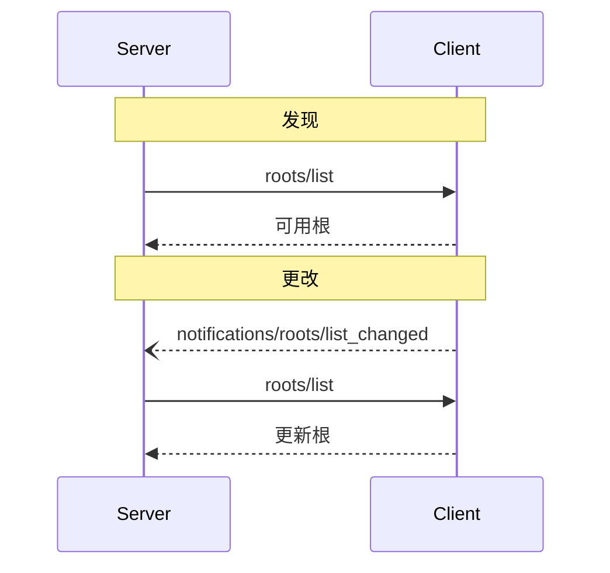


**协议修订**: 


Model Context Protocol (MCP) 提供了一种标准化方式，使客户端能够向服务器公开文件系统“根”。根定义了服务器在文件系统中可以操作的边界，使其了解可以访问的目录和文件。服务器可以从支持的客户端请求根列表，并在该列表更改时接收通知。

## 用户交互模型

MCP 中的根通常通过工作区或项目配置界面公开。

例如，实现可以提供一个工作区/项目选择器，允许用户选择服务器应有权访问的目录和文件。这可以与版本控制系统或项目文件的自动工作区检测相结合。

然而，实现可以通过任何适合其需求的界面模式公开根&mdash;协议本身不强制规定任何特定的用户交互模型。

## 功能

支持根的客户端 **必须** 在 [初始化]() 期间声明 `roots` 功能：

```json
{
  "capabilities": {
    "roots": {
      "listChanged": true
    }
  }
}
```

`listChanged` 表示客户端是否会在根列表更改时发出通知。

## 协议消息

### 列出根

要检索根，服务器发送 `roots/list` 请求：

**请求:**
```json
{
  "jsonrpc": "2.0",
  "id": 1,
  "method": "roots/list"
}
```

**响应:**
```json
{
  "jsonrpc": "2.0",
  "id": 1,
  "result": {
    "roots": [
      {
        "uri": "file:///home/user/projects/myproject",
        "name": "My Project"
      }
    ]
  }
}
```

### 根列表更改

当根更改时，支持 `listChanged` 的客户端 **必须** 发送通知：

```json
{
  "jsonrpc": "2.0",
  "method": "notifications/roots/list_changed"
}
```

## 消息流程



## 数据类型

### 根

根定义包括：

- `uri`: 根的唯一标识符。在当前规范中，这 **必须** 是 `file://` URI。
- `name`: 用于显示目的的可选人类可读名称。

不同用例的示例根：

#### 项目目录
```json
{
  "uri": "file:///home/user/projects/myproject",
  "name": "My Project"
}
```

#### 多个存储库
```json
[
  {
    "uri": "file:///home/user/repos/frontend",
    "name": "Frontend Repository"
  },
  {
    "uri": "file:///home/user/repos/backend",
    "name": "Backend Repository"
  }
]
```

## 错误处理

客户端 **应** 返回标准 JSON-RPC 错误以处理常见故障情况：

- 客户端不支持根: `-32601` (方法未找到)
- 内部错误: `-32603`

错误示例:
```json
{
  "jsonrpc": "2.0",
  "id": 1,
  "error": {
    "code": -32601,
    "message": "不支持根",
    "data": {
      "reason": "客户端没有根功能"
    }
  }
}
```

## 安全考虑

1. 客户端 **必须**:
   - 仅公开具有适当权限的根
   - 验证所有根 URI 以防止路径遍历
   - 实施适当的访问控制
   - 监控根的可访问性

2. 服务器 **应**:
   - 处理根变得不可用的情况
   - 在操作期间尊重根边界
   - 验证所有路径是否符合提供的根

## 实施指南

1. 客户端 **应**:
   - 在向服务器公开根之前提示用户同意
   - 提供清晰的用户界面进行根管理
   - 在公开之前验证根的可访问性
   - 监控根的更改

2. 服务器 **应**:
   - 在使用之前检查根功能
   - 优雅地处理根列表更改
   - 在操作中尊重根边界
   - 适当地缓存根信息
