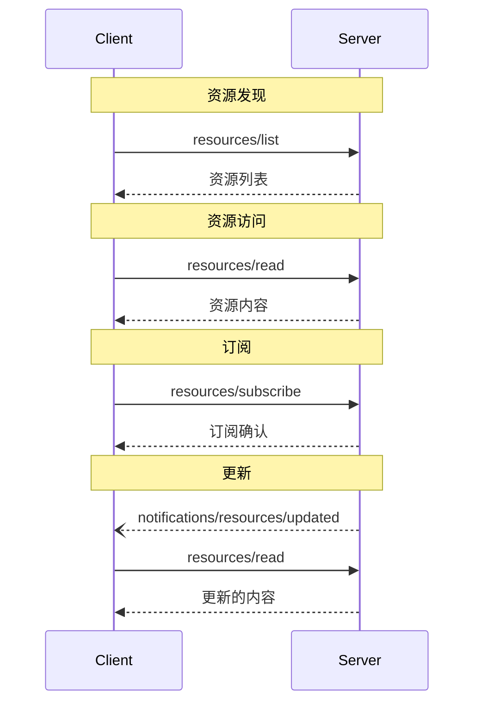


**协议修订**: 


Model Context Protocol (MCP) 提供了一种标准化方式，使服务器能够向客户端公开资源。资源允许服务器共享为语言模型提供上下文的数据，例如文件、数据库模式或特定于应用程序的信息。每个资源都由一个 [URI](https://datatracker.ietf.org/doc/html/rfc3986) 唯一标识。

## 用户交互模型

MCP 中的资源设计为 **应用程序驱动**，主机应用程序根据其需求确定如何包含上下文。

例如，应用程序可以：
* 通过 UI 元素公开资源，以供显式选择，显示为树或列表视图
* 允许用户搜索和过滤可用资源
* 实现基于启发式或 AI 模型选择的自动上下文包含


然而，实现者可以通过任何适合其需求的界面模式公开资源&mdash;协议本身不强制规定任何特定的用户交互模型。

## 功能

支持资源的服务器 **必须** 声明 `resources` 功能：

```json
{
  "capabilities": {
    "resources": {
      "subscribe": true,
      "listChanged": true
    }
  }
}
```

该功能支持两个可选功能：
- `subscribe`: 客户端是否可以订阅以接收单个资源更改的通知。
- `listChanged`: 服务器是否会在可用资源列表更改时发出通知。

`subscribe` 和 `listChanged` 都是可选的&mdash;服务器可以支持两者、任一或都不支持：

```json
{
  "capabilities": {
    "resources": {}  // 不支持任何功能
  }
}
```

```json
{
  "capabilities": {
    "resources": {
      "subscribe": true  // 仅支持订阅
    }
  }
}
```

```json
{
  "capabilities": {
    "resources": {
      "listChanged": true  // 仅支持列表更改通知
    }
  }
}
```

## 协议消息

### 列出资源

要发现可用资源，客户端发送 `resources/list` 请求。此操作支持 [分页]()。

**请求:**
```json
{
  "jsonrpc": "2.0",
  "id": 1,
  "method": "resources/list",
  "params": {
    "cursor": "optional-cursor-value"
  }
}
```

**响应:**
```json
{
  "jsonrpc": "2.0",
  "id": 1,
  "result": {
    "resources": [
      {
        "uri": "file:///project/src/main.rs",
        "name": "main.rs",
        "description": "主要应用程序入口点",
        "mimeType": "text/x-rust"
      }
    ],
    "nextCursor": "next-page-cursor"
  }
}
```

### 读取资源

要检索资源内容，客户端发送 `resources/read` 请求：

**请求:**
```json
{
  "jsonrpc": "2.0",
  "id": 2,
  "method": "resources/read",
  "params": {
    "uri": "file:///project/src/main.rs"
  }
}
```

**响应:**
```json
{
  "jsonrpc": "2.0",
  "id": 2,
  "result": {
    "contents": [
      {
        "uri": "file:///project/src/main.rs",
        "mimeType": "text/x-rust",
        "text": "fn main() {\n    println!(\"Hello world!\");\n}"
      }
    ]
  }
}
```

### 资源模板

资源模板允许服务器使用 [URI 模板](https://datatracker.ietf.org/doc/html/rfc6570) 公开参数化资源。参数可以通过 [完成 API]() 自动完成。

**请求:**
```json
{
  "jsonrpc": "2.0",
  "id": 3,
  "method": "resources/templates/list"
}
```

**响应:**
```json
{
  "jsonrpc": "2.0",
  "id": 3,
  "result": {
    "resourceTemplates": [
      {
        "uriTemplate": "file:///{path}",
        "name": "项目文件",
        "description": "访问项目目录中的文件",
        "mimeType": "application/octet-stream"
      }
    ]
  }
}
```

### 列表更改通知

当可用资源列表更改时，声明了 `listChanged` 功能的服务器 **应** 发送通知：

```json
{
  "jsonrpc": "2.0",
  "method": "notifications/resources/list_changed"
}
```

### 订阅

该协议支持对资源更改的可选订阅。客户端可以订阅特定资源，并在其更改时接收通知：

**订阅请求:**
```json
{
  "jsonrpc": "2.0",
  "id": 4,
  "method": "resources/subscribe",
  "params": {
    "uri": "file:///project/src/main.rs"
  }
}
```

**更新通知:**
```json
{
  "jsonrpc": "2.0",
  "method": "notifications/resources/updated",
  "params": {
    "uri": "file:///project/src/main.rs"
  }
}
```

## 消息流程



## 数据类型

### 资源

资源定义包括：

- `uri`: 资源的唯一标识符
- `name`: 人类可读名称
- `description`: 可选描述
- `mimeType`: 可选 MIME 类型

### 资源内容

资源可以包含文本或二进制数据：

#### 文本内容
```json
{
  "uri": "file:///example.txt",
  "mimeType": "text/plain",
  "text": "资源内容"
}
```

#### 二进制内容
```json
{
  "uri": "file:///example.png",
  "mimeType": "image/png",
  "blob": "base64 编码的数据"
}
```

## 常见 URI 方案

该协议定义了几种标准 URI 方案。此列表并不详尽&mdash;实现者始终可以使用其他自定义 URI 方案。

### https://

用于表示可在网上获取的资源。

服务器 **应** 仅在客户端能够直接从网上获取和加载资源时使用此方案&mdash;即不需要通过 MCP 服务器读取资源。

对于其他用例，服务器 **应** 优先使用其他 URI 方案，或定义自定义方案，即使服务器本身将通过互联网下载资源内容。

### file://

用于标识行为类似于文件系统的资源。然而，资源不需要映射到实际的物理文件系统。

MCP 服务器 **可以** 使用 [XDG MIME 类型](https://specifications.freedesktop.org/shared-mime-info-spec/0.14/ar01s02.html#id-1.3.14) 标识 file:// 资源，如 `inode/directory`，以表示没有标准 MIME 类型的非常规文件（如目录）。

### git://

Git 版本控制集成。

## 错误处理

服务器 **应** 返回标准 JSON-RPC 错误以处理常见故障情况：

- 找不到资源: `-32002`
- 内部错误: `-32603`

错误示例:
```json
{
  "jsonrpc": "2.0",
  "id": 5,
  "error": {
    "code": -32002,
    "message": "找不到资源",
    "data": {
      "uri": "file:///nonexistent.txt"
    }
  }
}
```

## 安全考虑

1. 服务器 **必须** 验证所有资源 URI
2. **应** 对敏感资源实施访问控制
3. 二进制数据 **必须** 进行适当编码
4. 在操作之前 **应** 检查资源权限
