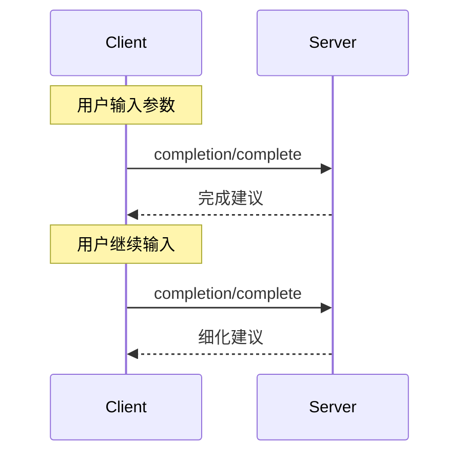


**协议修订**: 


Model Context Protocol (MCP) 提供了一种标准化方式，使服务器能够为提示和资源 URI 提供参数自动完成建议。这使用户在输入参数值时能够获得上下文建议，从而实现类似于 IDE 的丰富体验。

## 用户交互模型

MCP 中的完成设计支持类似于 IDE 代码完成的交互用户体验。

例如，应用程序可以在用户输入时在下拉菜单或弹出菜单中显示完成建议，并能够从可用选项中进行过滤和选择。

然而，实现者可以通过任何适合其需求的界面模式公开完成&mdash;协议本身不强制规定任何特定的用户交互模型。

## 协议消息

### 请求完成

要获取完成建议，客户端发送 `completion/complete` 请求，指定通过引用类型完成的内容：

**请求:**
```json
{
  "jsonrpc": "2.0",
  "id": 1,
  "method": "completion/complete",
  "params": {
    "ref": {
      "type": "ref/prompt",
      "name": "code_review"
    },
    "argument": {
      "name": "language",
      "value": "py"
    }
  }
}
```

**响应:**
```json
{
  "jsonrpc": "2.0",
  "id": 1,
  "result": {
    "completion": {
      "values": ["python", "pytorch", "pyside"],
      "total": 10,
      "hasMore": true
    }
  }
}
```

### 引用类型

该协议支持两种类型的完成引用：

| 类型 | 描述 | 示例 |
|------|------|------|
| `ref/prompt` | 按名称引用提示 | `{"type": "ref/prompt", "name": "code_review"}` |
| `ref/resource` | 引用资源 URI | `{"type": "ref/resource", "uri": "file:///{path}"}` |

### 完成结果

服务器返回按相关性排序的完成值数组，其中包括：

- 每个响应最多 100 个项目
- 可选的可用匹配总数
- 指示是否存在其他结果的布尔值

## 消息流程



## 数据类型

### CompleteRequest
- `ref`: 一个 `PromptReference` 或 `ResourceReference`
- `argument`: 包含以下内容的对象：
  - `name`: 参数名称
  - `value`: 当前值

### CompleteResult
- `completion`: 包含以下内容的对象：
  - `values`: 建议数组（最多 100 个）
  - `total`: 可选的匹配总数
  - `hasMore`: 其他结果标志

## 实施考虑

1. 服务器 **应**：
   - 返回按相关性排序的建议
   - 在适当的情况下实现模糊匹配
   - 限制完成请求的速率
   - 验证所有输入

2. 客户端 **应**：
   - 对快速完成请求进行去抖动
   - 在适当的情况下缓存完成结果
   - 优雅地处理缺失或部分结果

## 安全

实现 **必须**：
- 验证所有完成输入
- 实施适当的速率限制
- 控制对敏感建议的访问
- 防止基于完成的信息泄露
