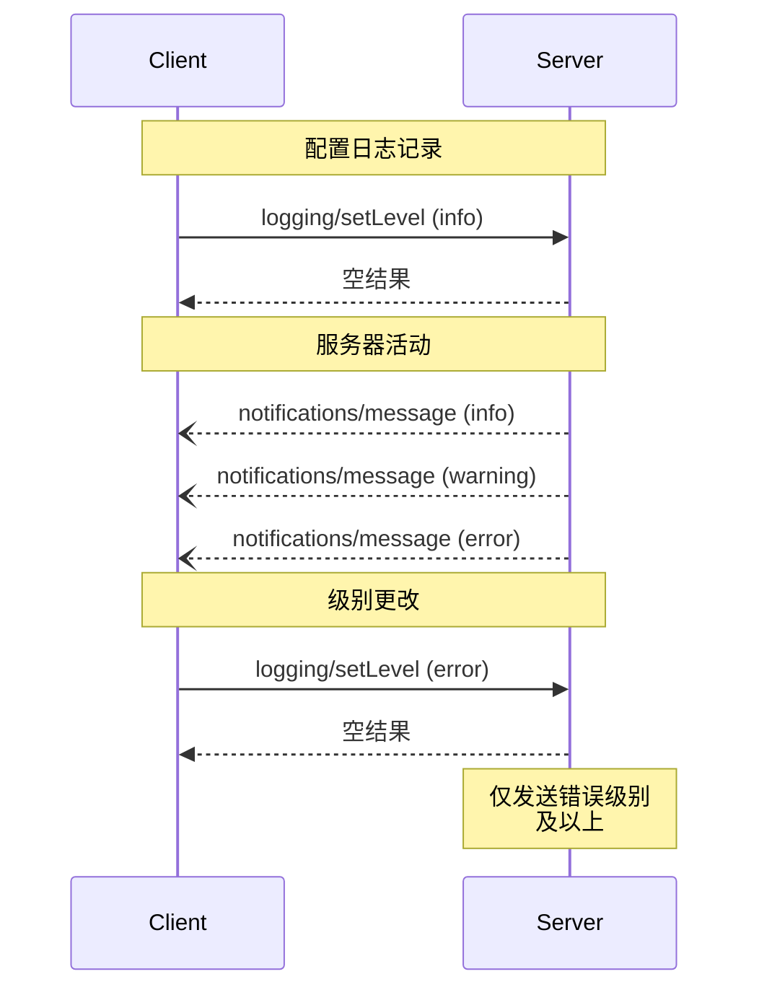


**协议修订**: 


Model Context Protocol (MCP) 提供了一种标准化方式，使服务器能够向客户端发送结构化日志消息。客户端可以通过设置最小日志级别来控制日志记录的详细程度，服务器发送包含严重级别、可选记录器名称和任意 JSON 可序列化数据的通知。

## 用户交互模型

实现者可以通过任何适合其需求的界面模式公开日志记录&mdash;协议本身不强制规定任何特定的用户交互模型。

## 功能

发送日志消息通知的服务器 **必须** 声明 `logging` 功能：

```json
{
  "capabilities": {
    "logging": {}
  }
}
```

## 日志级别

该协议遵循 [RFC 5424](https://datatracker.ietf.org/doc/html/rfc5424#section-6.2.1) 中指定的标准 syslog 严重级别：

| 级别      | 描述                          | 示例用例                        |
|-----------|-------------------------------|---------------------------------|
| debug     | 详细的调试信息                | 函数入口/退出点                 |
| info      | 一般信息性消息                | 操作进度更新                    |
| notice    | 正常但重要的事件              | 配置更改                        |
| warning   | 警告条件                      | 使用已弃用的功能                |
| error     | 错误条件                      | 操作失败                        |
| critical  | 严重条件                      | 系统组件故障                    |
| alert     | 必须立即采取行动              | 检测到数据损坏                  |
| emergency | 系统不可用                    | 完全系统故障                    |

## 协议消息

### 设置日志级别

要配置最小日志级别，客户端 **可以** 发送 `logging/setLevel` 请求：

**请求:**
```json
{
  "jsonrpc": "2.0",
  "id": 1,
  "method": "logging/setLevel",
  "params": {
    "level": "info"
  }
}
```

### 日志消息通知

服务器使用 `notifications/message` 通知发送日志消息：

```json
{
  "jsonrpc": "2.0",
  "method": "notifications/message",
  "params": {
    "level": "error",
    "logger": "database",
    "data": {
      "error": "连接失败",
      "details": {
        "host": "localhost",
        "port": 5432
      }
    }
  }
}
```

## 消息流程



## 错误处理

服务器 **应** 返回标准 JSON-RPC 错误以处理常见故障情况：

- 无效的日志级别: `-32602` (无效参数)
- 配置错误: `-32603` (内部错误)

## 实施考虑

1. 服务器 **应**：
   - 限制日志消息的速率
   - 在数据字段中包含相关上下文
   - 使用一致的记录器名称
   - 删除敏感信息

2. 客户端 **可以**：
   - 在 UI 中显示日志消息
   - 实现日志过滤/搜索
   - 以视觉方式显示严重性
   - 持久化日志消息

## 安全

1. 日志消息 **不得** 包含：
   - 凭据或密钥
   - 个人身份信息
   - 可能帮助攻击的内部系统详细信息

2. 实现 **应**：
   - 限制消息速率
   - 验证所有数据字段
   - 控制日志访问
   - 监控敏感内容
